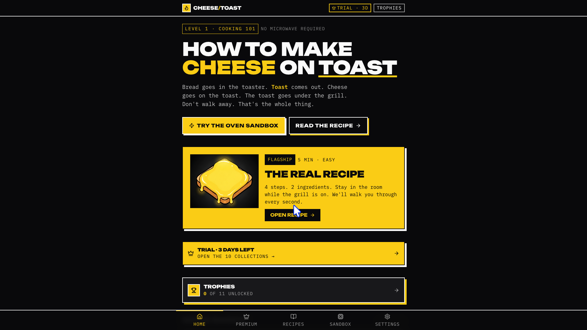

# 🧀🔥 Cheese on Toast

A mobile-first PWA cooking app that teaches teenagers basic kitchen skills through retro arcade-style cooking simulators.

Live app: https://toasted-cheese-map.emergent.host
## Preview



## What it does

Cheese on Toast lets users practise cooking steps in a playful simulator before trying the real recipe.

The app includes:

- Arcade-style cooking challenges
- Achievements, streak counters, and perfect-run scoring
- Beginner-friendly recipes
- Mobile-first PWA install support
- Brutalist black/yellow visual design
- Privacy, terms, and contact pages

## Target users

- Teens learning basic cooking
- Parents looking for safer beginner kitchen tools
- University students learning simple meals

## Tech stack

- React PWA
- TailwindCSS
- FastAPI
- MongoDB
- Stripe Checkout
- Resend
- Gemini-generated recipe illustrations

## Status

Hosted MVP.

This project is live, public, and under active development.

## Local development

### Frontend

```bash
cd frontend
npm install
npm run dev
```

### Backend

```bash
cd backend
pip install -r requirements.txt
uvicorn main:app --reload
```

## Legal pages

- `/privacy`
- `/terms`
- `/contact`
